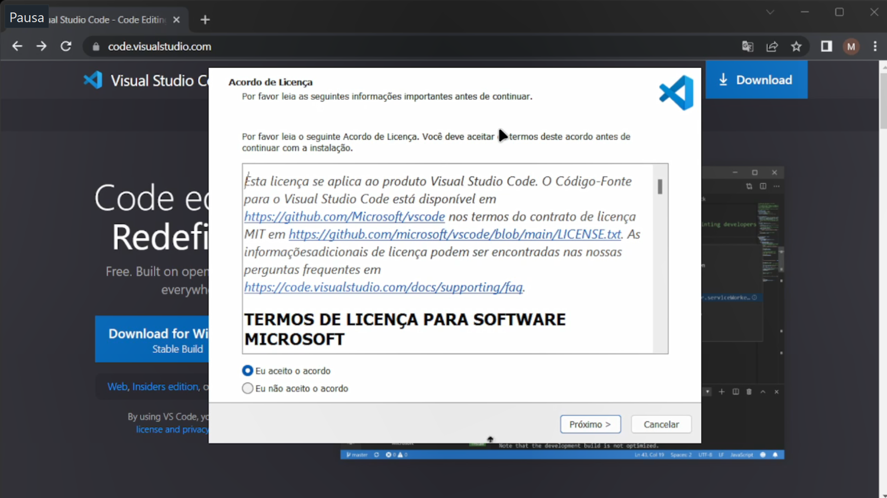
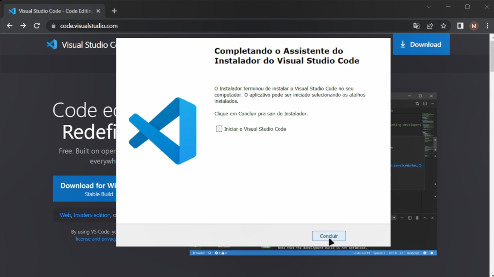

# Instalando o Visual Studio Code

*Criado em Março de 2023 por Maxwell Anderson*

- [Instalando o Visual Studio Code](#instalando-o-visual-studio-code)
  - [Introdução](#introdução)
  - [Instalação](#instalação)

## Introdução

O Visual Studio Code é um editor de código-fonte desenvolvido pela Microsoft para Windows, Linux e macOS. Ele inclui suporte para depuração, controle de versão Git incorporado, realce de sintaxe, complementação inteligente de código, snippets e refatoração de código.

## Instalação

Realize os passos abaixo para instalar o Visual Studio Code no Windows:

1. Para instalar o Visual Studio Code, acesse o site oficial do [Visual Studio Code](https://code.visualstudio.com/) e clique no botão **Download for Windows**. 
   
  

2. O download será iniciado. Após o término, clique no arquivo baixado para iniciar a instalação.
3. A tela inicial da instalação será exibida. Clique no botão **Próximo** para continuar. 
  
  

4. A tela **Selecionar tarefas adicionais** será exibida. Marque as opções conforme figura abaixo e clique no botão **Próximo**. 
   
  

5. A tela de conclusão da instalação será exibida. Clique no botão **Concluir** para finalizar a instalação. 
   
  

Pronto! O Visual Studio Code foi instalado com sucesso no Windows.

Agora você poderá seguir para a próxima aula.	

[Instalando o Git no Windows](03.%20Instalando%20o%20Git%20no%20Windows.md)

[Índice](../README.md)
